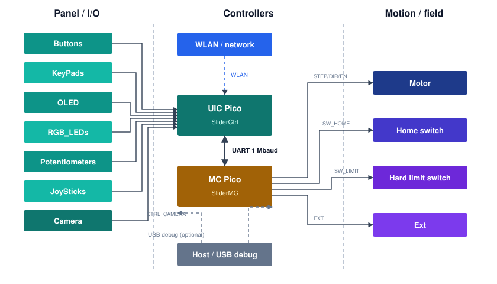

# SliderCtrl / JKSlider

**Pro-feel motorized camera slider control for the set** — open MicroPython firmware on a **Raspberry Pi Pico** (or compact **RP2040-Zero** for smaller designs), built to shoot, not to demo.

**JKSlider** is the turnkey control panel. **`MC_Client`** + **`UIC_Base`** are the UIC libraries for your own DIY slider projects (UART to SliderMC + OLED/LED/camera).

> IMPORTANT: Docs and manuals moved to repository **SliderDOC** https://github.com/fablab-wue/SliderDoc

---

## Features

**Easy on set. Ready for every take.** Analogue knobs, muscle-memory buttons, soft limits, hard-limit home, STOP / EMO — without a laptop in the shot.

- **Feel the move** — SPEED & ACCEL under your fingertips · live retarget · sine-smooth ramps  
- **Mark · Recall · Loop** — Pos A / B / C that survive power-off · pair loops for interviews & product  
- **Time your story** — DELAY walk-ins · TIMELAPSE dividers for hyper-smooth long takes  
- **Stay in command** — tap/hold MOVE cruise · FAST jog · optional joystick · OPTION modifiers · boot unlock  
- **Eyes-off status** — dual-colour OLED (SSD1306 / SH1106 / SSD1309 selectable) · RGB LED · optional NeoPixel (same colours)  
- **Maker-friendly** — upcycle rails & linear units · off-the-shelf STEP/DIR steppers or servo drivers (A4988, DRV8825, TMC, …)

---

## One board pair. Every net.

UIC panel I/O on one Pico (or compact **RP2040-Zero**), motion (STEP/DIR, home, limits, Ext) on SliderMC, linked by UART — see the overview, then the pinouts.



**Why two boards**

- Dedicated motion MCU — OLED, keypad, pots, and WLAN never steal STEP timing (less jitter / stutter)
- **MicroPython + AsyncIO** on the UIC — easy panel programming; Thonny / REPL DIY workflow
- More free UIC pins for buttons, pots, LEDs, displays; replaceable face (forks may use other hosts as UART clients)
- **Handheld wired remote** — UIC in hand, MC by the motor driver and PSU; only a **4-wire** cable (**5 V**, **GND**, **TX**, **RX**)
- Build and debug panel and axis separately

Trade-off: a second Pico (~€5), a little more wiring and housing. Full philosophy, pros/cons, and component lists: [docs/ARCHITECTURE.md](docs/ARCHITECTURE.md).

| UIC may connect | MC may connect |
|-----------------|----------------|
| Buttons, KeyPads, OLED, RGB/NeoPixel, pots, JoySticks, Camera | Motor / STEP·DIR driver, home switch, hard limits, Ext, `DRV_ERROR` |
| Optional WLAN, USB debug, UART → MC | USB debug, UART → UIC |

UIC keypad/button wiring on a stock Raspberry Pi Pico — matrix, pots, display, RGB, camera, and UART to SliderMC colour-coded so you can build without hunting the datasheet. A compact **RP2040-Zero** (same GPIO numbers) also works for smaller handheld remotes or rail enclosures.


SliderMC motion Pico pinout: see [docs/ARCHITECTURE.md](docs/ARCHITECTURE.md) and [PINS.md](../SliderMC/docs/PINS.md) / [`pico_pinout_mc.png`](../SliderMC/docs/img/pico_pinout_mc.png).

---

## Quick start

1. Flash [MicroPython](https://micropython.org/download/RPI_PICO/) onto the **UIC** Pico (or matching UF2 for an **RP2040-Zero**). Flash SliderMC onto the **motion** Pico (or Zero).  
2. Wire the **crossed UART** (GP16/17 both sides, shared GND) — see [Technical Manual — Link](manuals/JKSlider_Technical_Manual_Link.md#communication-mc--uic).  
3. Copy `SliderPins.example.py` → `SliderPins.py` and edit **that file only** for your hardware (pins + behaviour). Shipped defaults live in `MC_config.py` / `UIC_config.py` / `JKSliderConfig.py` — see the [Technical Manual](manuals/JKSlider_Technical_Manual.md) ([Config](manuals/JKSlider_Technical_Manual_Config.md), [Panel](manuals/JKSlider_Technical_Manual_Panel.md)).  
4. Copy `MC_client.py`, `UIC_base.py`, `MC_config.py`, `UIC_config.py`, `JKSlider.py`, `JKSliderConfig.py` (and OLED drivers) to the UIC ([Thonny](https://thonny.org/) or `mpremote`) — [Bring-up](manuals/JKSlider_Technical_Manual_BringUp.md).  
5. Run the panel:

```python
import JKSlider
JKSlider.run()
```

`await start()` unlocks the MC with `\n` and expects the welcome banner (retry 100 ms, 3 s). If the MC is missing, the UIC prints a timeout on USB/REPL and continues without motion.

Or try the motion library alone:

```python
import SimpleExample
SimpleExample.run()
```

Full bring-up (Thonny, wiring, variants, checklist): **[manuals/JKSlider_Technical_Manual.md](manuals/JKSlider_Technical_Manual.md)**  
MC protocol / commands (sibling clone): **[../SliderMC/docs/PROTOCOL.md](../SliderMC/docs/PROTOCOL.md)**  
Rails, motors, power, mounting: **[manuals/JKSlider_Hardware_Manual.md](manuals/JKSlider_Hardware_Manual.md)**  
UIC ↔ SliderMC split: **[docs/ARCHITECTURE.md](docs/ARCHITECTURE.md)**

---

## MC_Client + UIC_Base — API for your own DIY projects

Compose a UART motion client (`MC_Client`) with local UI (`UIC_Base`) on the UIC Pico: millimetre API to **SliderMC**, soft & hard limits, EMO, RGB / NeoPixel / OLED. STEP/DIR generation runs on the motion Pico.

Use them when you want a custom UI, scripted moves, or a different panel — JKSlider is just one application on top.

```python
import uasyncio as asyncio
from MC_client import MC_Client
from UIC_base import UIC_Base

async def main():
    mc = MC_Client()
    ui = UIC_Base()

    mc.set_status_callback(ui.on_status)
    await mc.start()
    await ui.start()

    mc.enable(True)
    mc.setSpeed(40)
    mc.setAcceleration(150)
    mc.home()
    await mc.wait()
    mc.moveTo(100)
    await mc.wait()
    mc.move(-25)
    await asyncio.sleep(2)
    mc.stop()
    await mc.wait()
    mc.enable(False)

asyncio.run(main())
```

| Idea | Entry point |
|------|-------------|
| Point-to-point demo | `SimpleExample.py` |
| Pot → velocity | `JoystickExample.py` |
| Full camera panel | `JKSlider.py` |
| Full API reference | [docs/API.md](docs/API.md) |

For your hardware, copy `SliderPins.example.py` → `SliderPins.py` and edit **that file only**.

---

## Requirements - Base for all SLiders

- Raspberry Pi Pico (RP2040) or Pico W or RP2040-Zero
- MicroPython with `rp2.PIO` and `uasyncio`  
- External STEP/DIR motor driver
- Slider mechanics — see Hardware Manual

## Requirements - JKSlider

- Buttons or 3x4 keypad
- Potentiometers for SPEED and ACCEL
- RGB LED
- OLED display
- (Optional) joystick

## Requirements - B4Slider

- 4 Buttons
- RGB LED
- Potentiometer for SPEED
- (Optional) Potentiometer for ACCEL

---

## License

Copyright (c) 2026 Jochen Krapf \<jk@nerd2nerd.org\>

Licensed under the [MIT License](LICENSE).

Company names and product names mentioned in this project are trademarks or registered trademarks of their respective owners. Use here is for identification only.

`ssd1306.py` / `sh1106.py` / `ssd1309.py` are based on common MicroPython OLED patterns (SSD1306 lineage typically MIT). `oledfont.py` uses Adafruit GFX 5×7 font data (BSD-style upstream). Keep their notices if you redistribute those files alone.
